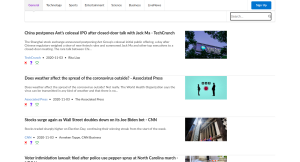

<h1> News_App</h1>
<ul>
<li>This is app news. 
<li>There are few categories of  news. 
<li>Each click on category fetch from api news list which is of this category. 
<li>scrolling down is with animation. 
<li>Each post has 3 icons with tooltip (decide whether the news are fake, real or some where between. 
<li>General category is the homepage. 
<li>There is a search bar which filters out the posts by keyword in search bar. 
<li>category of live news - a user can create news of his own for event that he just saw- by adding title description and image. 
<li>Each post created by this user can be deleted and edited via pop up. 
</ul>

